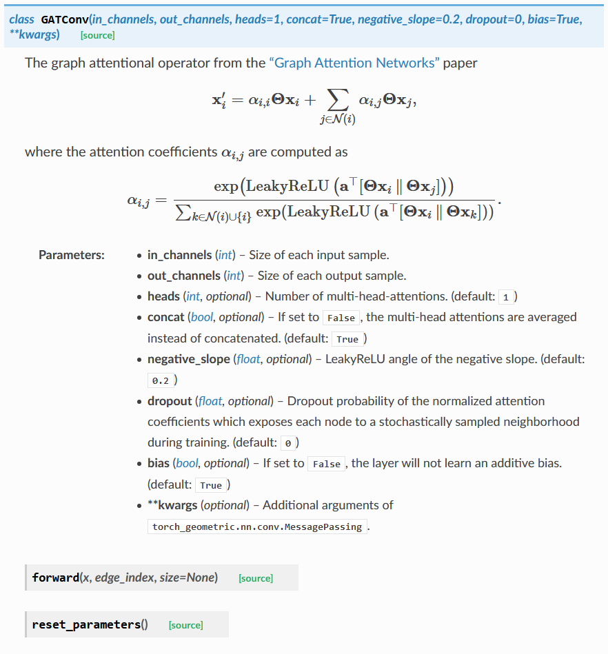

# DEEP LEARNING IN PYTHON

## 1 PYTORCH_GEOMETRIC

### 1.1 Using Docker

```bash
docker run -it --rm -v /c/Users/Benny/Documents/Projects/DLHandsOn/DLinPython/PyTorchGeometric:/workspace imcomking/pytorch_geometric:latest /bin/bash
```

### 1.2 Graph Attention Network (GATConv, see appendix for doc)

#### 1.2.1 Articles

- [浅谈 Attention 机制的理解](https://www.cnblogs.com/ydcode/p/11038064.html)

## 2 Competitions

### 2.1 Recommendation Systems

#### 2.1.1 [天池新人实战赛之\[离线赛\]](https://tianchi.aliyun.com/competition/entrance/231522/introduction)

- [协同过滤（Collaborative Filtering）学习笔记](https://www.jianshu.com/p/d15ba37755d1)
- [推荐系统中召回策略](https://www.cnblogs.com/graybird/p/11393511.html)
- [CIKM 2019 EComm AI：超大规模推荐之用户兴趣高效检索 赛题解读及阿里深度树匹配技术实践](https://tianchi.aliyun.com/course/video?spm=5176.12586971.1001.45.4ee274a3LPTFrh&liveId=41072)

## Appendix

- GATConv Doc

