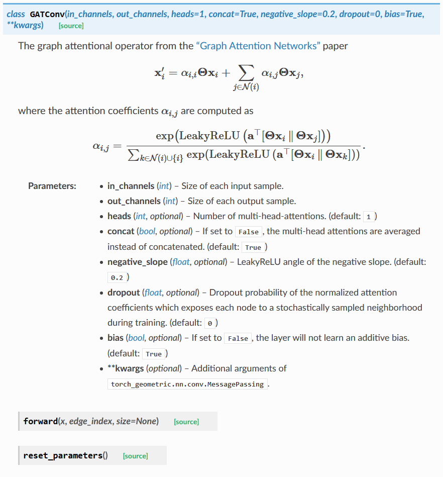

# DEEP LEARNING IN PYTHON

## 1 PyTorch Geometric

### 1.1 Docker Image ```imcomking/pytorch_geometric```

```bash
docker run -it --rm -v /c/Users/Benny/Documents/Projects/DLHandsOn/DLinPython/PyTorchGeometric:/workspace imcomking/pytorch_geometric:latest /bin/bash
```

### 1.2 Graph Attention Network

- [Graph Attention Networks](https://arxiv.org/abs/1710.10903)
- [浅谈 Attention 机制的理解](https://www.cnblogs.com/ydcode/p/11038064.html)

### 1.3 Graph Isomorphism Network

- [How Powerful are Graph Neural Networks?](https://arxiv.org/abs/1810.00826)
- [Understanding Graph Isomorphism Network for Brain MR Functional Connectivity Analysis](http://cn.arxiv.org/abs/2001.03690)

### 1.4 Differentiable Pooling

- [Hierarchical Graph Representation Learning with Differentiable Pooling](https://arxiv.org/abs/1806.08804)

## 2 TIANCHI

### 2.1 [FreshCompOffline](https://tianchi.aliyun.com/competition/entrance/231522/introduction)

- [协同过滤（Collaborative Filtering）学习笔记](https://www.jianshu.com/p/d15ba37755d1)
- [推荐系统中召回策略](https://www.cnblogs.com/graybird/p/11393511.html)
- [CIKM 2019 EComm AI：超大规模推荐之用户兴趣高效检索 赛题解读及阿里深度树匹配技术实践](https://tianchi.aliyun.com/course/video?spm=5176.12586971.1001.45.4ee274a3LPTFrh&liveId=41072)
- [CIKM 2019 EComm AI：用户行为预测 赛题解读与阿里GNN推荐结合实践分享](https://tianchi.aliyun.com/course/video?spm=5176.12586971.1001.50.6fc147c4o8k4tC&liveId=41071)

## Appendix

- GATConv Doc

