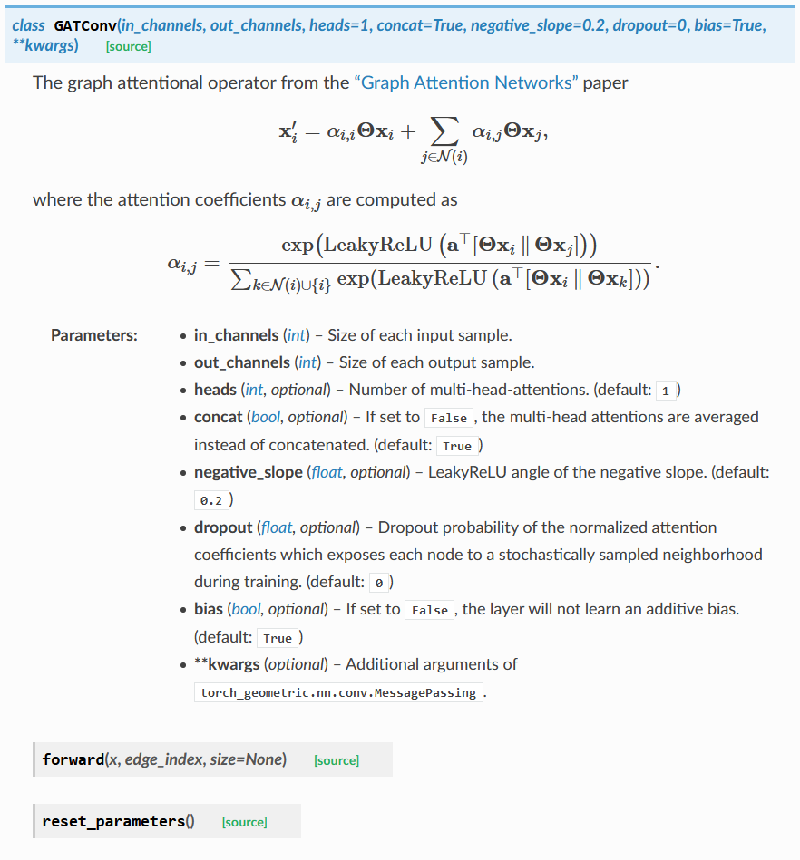

# DEEP LEARNING IN PYTHON

## 1 PYTORCH_GEOMETRIC

### 1.1 Using Docker

```bash
docker run -it --rm -v /c/Users/Benny/Documents/Projects/DLHandsOn/DLinPython/pytorch_geometric:/pytorch_geometric imcomking/pytorch_geometric:latest /bin/bash
```

### 1.2 Graph Attention Network (GATConv, see appendix for doc)

#### 1.2.1 Articles

- [浅谈 Attention 机制的理解](https://www.cnblogs.com/ydcode/p/11038064.html)

## Appendix

- GATConv Doc

